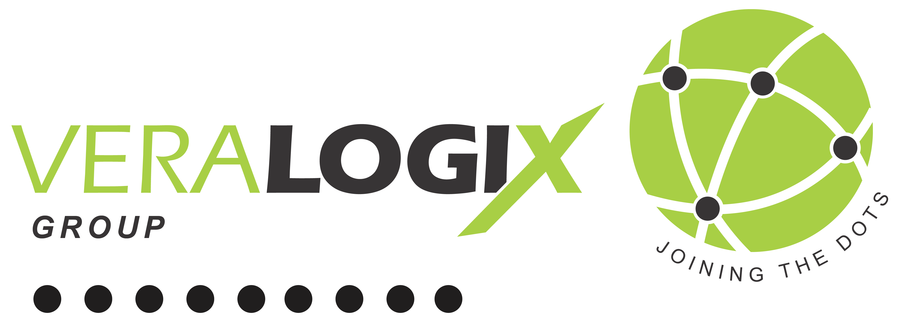
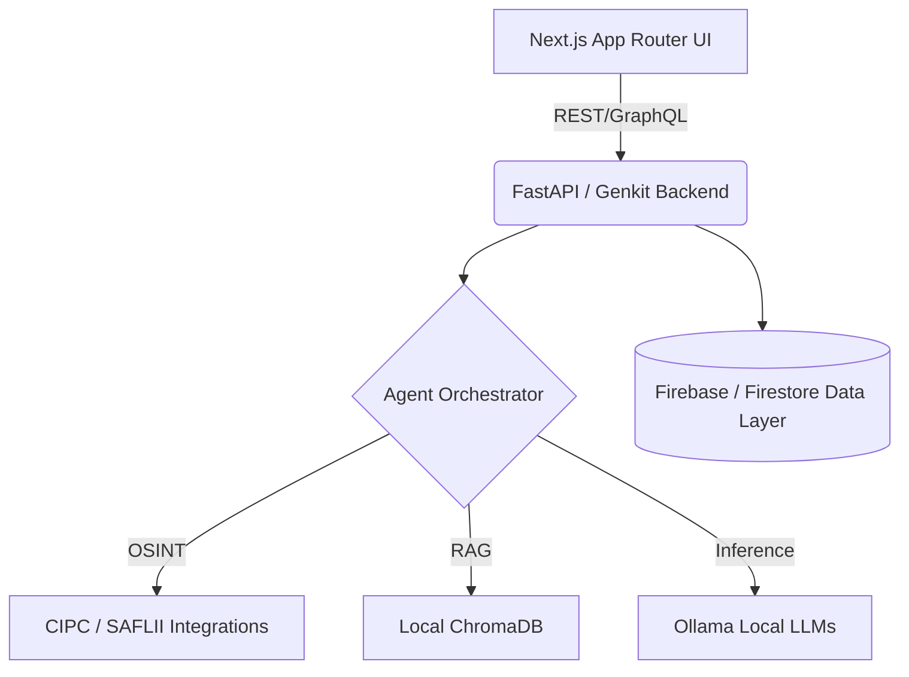

<div align="center">
  
  
  <br />

  # Veralogix SecureConnect Platform

  **Next-Generation AI Orchestration & OSINT for the Legal, Mining & Corporate Sectors**

  [](https://opensource.org/licenses/MIT)
  [](https://nextjs.org/)
  []()
  []()

  *Veralogix empowers South African law firms, corporate compliance teams, and advocacy groups with deep knowledge graphs, local data sovereignty, and AI-driven document intelligence.*

  ⭐ **Please Star this repository if you find it valuable!** ⭐
</div>

---

## 📑 Table of Contents

- [Quick Start](#-quick-start)
- [Key Features](#-key-features)
- [See It In Action](#-see-it-in-action)
- [How Veralogix Transforms Organizations](#-how-veralogix-transforms-organizations)
- [Architecture & Tech Stack](#-architecture--tech-stack)
- [Roadmap](#-roadmap)
- [Contributing](#-contributing)
- [License & Community](#-license--community)

---

## 🚀 Quick Start

Getting started with the Veralogix prototype environment is simple. 

### Prerequisites
- Node.js 20+
- Python 3.11+ (for OSINT/RAG backend)
- Ollama (for local sovereign LLM processing)

### Installation

```bash
# 1. Clone the repository
git clone https://github.com/VeralogixCatalyst/VeraLogix-SecureConnect-App.git
cd VeraLogix-SecureConnect-App

# 2. Install Frontend Dependencies
npm install

# 3. Configure Environment
cp .env.example .env.local
# Update your Firebase and backend API credentials

# 4. Start the Development Server
npm run dev
```

> [!TIP]
> The application will start at `http://localhost:3000`. The prototype includes an automatic seeder that populates sample data on your first run.

---

## ⚡ Key Features

- 🕵️ **Knowledge Graph Explorer:** Uncover hidden corporate connections, cross-directorships, and ultimate beneficial ownership clusters with real-time interactive node visualization.
- 📄 **Document Intelligence Studio:** Process massive legal PDFs, contracts, and court judgments using locally-hosted RAG models that extract clauses and summarize risks.
- 🌍 **OSINT & CIPC Integration:** Deep API connectors designed to pull structured data from South African public records, SAFLII, and CIPC registries.
- 🔐 **POPIA Compliant & Sovereign:** All sensitive document inference runs on local infrastructure or private tenant enclaves, guaranteeing strict data sovereignty.
- 🤖 **Multi-Agent Orchestration:** Specialized AI sub-agents collaborate to verify facts, cross-reference claims, and draft legal reports simultaneously.

---

## 🎥 See It In Action

### Walkthrough Video
Watch a comprehensive 5-minute deep dive into the platform's capabilities:

<div align="center">
  <a href="https://www.youtube.com/watch?v=VIDEO_ID">
    
  </a>
  <br/>
  <em>Click above to watch the Veralogix Platform Walkthrough</em>
</div>

### Visual Gallery

#### 1. Command Center Dashboard
*A holistic view of active investigations, system health, and recent intelligence alerts.*
<div align="center">
  
</div>

#### 2. Corporate Cluster Analysis (Knowledge Graph)
*Visualizing cross-directorships and subsidiary networks in the Mpumalanga mining sector.*
<div align="center">
  
</div>

#### 3. Document Intelligence Studio
*AI-assisted contract review and anomaly detection on scanned legacy documents.*
<div align="center">
  
</div>

#### 4. OSINT Search & CIPC Entity Resolution
*Real-time entity resolution pulling from multiple public data sources seamlessly.*
<div align="center">
  
</div>

---

## 🏛️ How Veralogix Transforms Organizations

Veralogix is built from the ground up to solve the massive data-fragmentation problem in the South African legal and corporate sectors. 

### Before vs. After Veralogix

| Metric | Before Veralogix | After Veralogix |
|--------|-----------------|-----------------|
| **Entity Discovery** | Weeks of manual CIPC searches and PDF cross-referencing. | **Seconds** via interactive knowledge graphs. |
| **Document Review** | High billable hours spent skimming hundreds of contract pages. | **Instant anomaly detection** and clause extraction via RAG. |
| **Data Privacy** | Cloud APIs risking POPIA compliance and data leaks. | **100% Sovereign local inference** on sensitive files. |
| **Investigation** | Siloed data across email, local drives, and public records. | **Unified OSINT dashboard** linking all intelligence automatically. |

### Targeted Impact
- **For Law Firms & Corporate Counsel:** Drastically reduce non-billable discovery hours. Automate the generation of initial case summaries and structural corporate breakdowns.
- **For Compliance & Risk Teams:** Continuously monitor vendor networks and identify conflicts of interest in real-time, especially critical in the complex structures of the resources and mining sectors.
- **For Community Advocacy:** Empower NGOs with enterprise-grade OSINT tools to trace corporate accountability, environmental compliance, and community agreements in regions like Mpumalanga.

---

## 🛠️ Architecture & Tech Stack

Veralogix utilizes a highly scalable, modern, and locally-deployable tech stack:



- **Frontend:** Next.js 15, React, Tailwind CSS, shadcn/ui.
- **Backend Services:** Firebase, Genkit, FastAPI (Python microservices).
- **AI / ML Layer:** Ollama (Llama 3 / Mistral), ChromaDB, LangChain.
- **Infrastructure:** Docker, Google Cloud (for non-sensitive sync), Local servers (for sovereign inference).

---

## 🗺️ Roadmap

- [x] Initial Repository Architecture & Firebase Prototype Bindings
- [ ] Connect Command Center Dashboard to Live Agent Logs
- [ ] Implement Genkit AI Flow Orchestration
- [ ] Deploy Local RAG Document Intelligence pipeline
- [ ] Finalize UI for OSINT Network Graphs
- [ ] Automated Component Testing (Vitest/Playwright)

---

## 🤝 Contributing

We welcome contributions from the community, especially regarding South African data integrations and OSINT tooling!

Please see our [Contributing Guidelines](CONTRIBUTING.md) for details on how to submit pull requests, report issues, and set up your development environment.

---

## ⚖️ License & Community

This project is licensed under the MIT License - see the [LICENSE](LICENSE) file for details.

**Join the movement for corporate transparency and intelligent legal operations.**
- 📧 Contact us: [admin@veralogix.com](mailto:admin@veralogix.com)
- 🌐 Website: [veralogix.com](https://veralogix.com)

<div align="center">
  <sub>Built with precision in South Africa.</sub>
</div>
