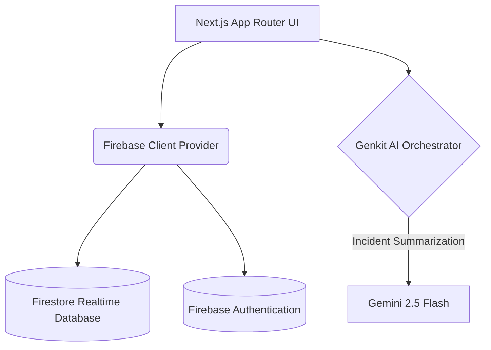

<div align="center">
  <a href="https://veralogix.com/">
    <picture>
      <source media="(prefers-color-scheme: dark)" srcset="https://iili.io/KUXIzXV.png">
      <source media="(prefers-color-scheme: light)" srcset="https://iili.io/KUXIxzQ.png">
      
    </picture>
  </a>
  
  <br />

  # VeraLogix SecureConnect™

  **Proactive Autonomous Security Ecosystem & Smart Community Platform**

  [](https://opensource.org/licenses/MIT)
  [](https://nextjs.org/)
  []()
  []()

  *VeraLogix SecureConnect empowers estates, property managers, and security teams with AI-driven access control, automated incident resolution, and seamless resident experiences.*

  ⭐ **Please Star this repository if you find it valuable!** ⭐
</div>

---

## 📑 Table of Contents

- [Quick Start](#-quick-start)
- [Key Features](#-key-features)
- [See It In Action](#-see-it-in-action)
- [How VeraLogix Transforms Communities](#-how-veralogix-transforms-communities)
- [Architecture & Tech Stack](#-architecture--tech-stack)
- [Roadmap](#-roadmap)
- [Contributing](#-contributing)
- [License & Community](#-license--community)

---

## 🚀 Quick Start

Getting started with the VeraLogix SecureConnect prototype environment is simple. 

### Prerequisites
- Node.js 20+
- A Firebase Project (for Authentication & Firestore)

### Installation

```bash
# 1. Clone the repository
git clone https://github.com/VeralogixCatalyst/VeraLogix-SecureConnect-App.git
cd VeraLogix-SecureConnect-App

# 2. Install Frontend Dependencies
npm install

# 3. Configure Environment
cp .env.example .env.local
# Update your Firebase credentials

# 4. Start the Development Server
npm run dev
```

> [!TIP]
> The application will start at `http://localhost:3000`. The prototype includes an automatic seeder (`PrototypeSeeder`) that populates sample doors, access logs, and incidents on your first run.

---

## ⚡ Key Features

- 🛡️ **Agent Command Center (CMD):** A holistic, real-time dashboard for security agents to monitor live access streams, handle perimeter breaches, and manage visitor flows.
- 📱 **Resident App (TEN):** Empowers residents with digital keys (Tap-to-Open), visitor pass generation, digital wallets, and maintenance requests.
- 🏛️ **Trustee Portal (TRU):** High-level governance, voting resolutions, and financial oversight for estate trustees and HOA members.
- 🔧 **Vendor Portal (VEN):** Seamlessly converts maintenance tickets into actionable work orders, complete with invoicing and evidence handover.
- 🤖 **Autonomous AI Agents:** Genkit-powered micro-agents that automatically summarize security incidents, predict maintenance failures, and draft response protocols.

---

## 🎥 See It In Action

### Walkthrough Video
Watch a comprehensive 5-minute deep dive into the platform's capabilities:

<div align="center">
  <a href="https://www.youtube.com/watch?v=VIDEO_ID">
    
  </a>
  <br/>
  <em>Click above to watch the VeraLogix Platform Walkthrough</em>
</div>

### Visual Gallery

#### 1. Agent Command Center
*Live telemetry, door status monitoring, and instant incident response for security personnel.*
<div align="center">
  
</div>

#### 2. Resident Digital Keys
*Frictionless mobile access, Tap-to-Open functionality, and secure visitor pass management.*
<div align="center">
  
</div>

#### 3. Trustee Governance & Resolutions
*Transparent voting and financial oversight for estate management.*
<div align="center">
  
</div>

#### 4. Vendor Work Orders
*End-to-end maintenance tracking from ticket creation to invoice submission.*
<div align="center">
  
</div>

---

## 🏛️ How VeraLogix Transforms Communities

VeraLogix SecureConnect is built from the ground up to solve the fragmented security and communication problems in modern estates and smart communities.

### Before vs. After VeraLogix

| Metric | Before VeraLogix | After VeraLogix |
|--------|-----------------|-----------------|
| **Access Control** | Disconnected physical remotes, vulnerable to cloning. | **Secure Digital Keys** with real-time revocation and audit trails. |
| **Incident Response** | Manual logbooks and delayed radio communication. | **Instant AI Summarization** and automated SOP protocols for agents. |
| **Data Privacy** | Unsecured physical visitor books risking POPIA violations. | **100% POPIA Compliant** cloud infrastructure with strict RBAC. |
| **Maintenance** | Messy email chains between residents, trustees, and vendors. | **Unified Workflow Pipeline** tracking tickets, evidence, and payments. |

### Targeted Impact
- **For Property Managers:** Drastically reduce administrative overhead. Automate the generation of incident reports and maintenance logs.
- **For Security Teams:** Transition from reactive guarding to proactive, AI-assisted monitoring.
- **For Residents:** Experience true frictionless living with mobile-first access and transparent community governance.

---

## 🛠️ Architecture & Tech Stack

VeraLogix SecureConnect utilizes a highly scalable, modern, and locally-deployable tech stack:



- **Frontend:** Next.js 15, React, Tailwind CSS, shadcn/ui.
- **Backend Services:** Firebase Firestore, Firebase Authentication.
- **AI Layer:** Google Genkit, Gemini Models.
- **Infrastructure:** Vercel / Firebase App Hosting.

---

## 🗺️ Roadmap

- [x] High-Fidelity UI Scaffolding & Shared Components
- [x] Initial Repository Architecture & Live Firebase Prototyping Bindings
- [ ] Implement robust RBAC (Role-Based Access Control)
- [ ] Connect Command Center Dashboard to Live Agent Logs
- [ ] Implement Genkit AI Flow Orchestration for Incident Reports
- [ ] Automated Component Testing (Vitest/Playwright)

---

## 🤝 Contributing

We welcome contributions from the community to help us build the future of smart access!

Please see our [Contributing Guidelines](CONTRIBUTING.md) for details on how to submit pull requests, report issues, and set up your development environment.

---

## ⚖️ License & Community

This project is licensed under the MIT License - see the [LICENSE](LICENSE) file for details.

**Join the movement for frictionless access and intelligent community operations.**
- 📧 Contact us: [admin@veralogix.com](mailto:admin@veralogix.com)
- 🌐 Website: [veralogix.com](https://veralogix.com)

<div align="center">
  <sub>Built with precision in South Africa.</sub>
</div>
