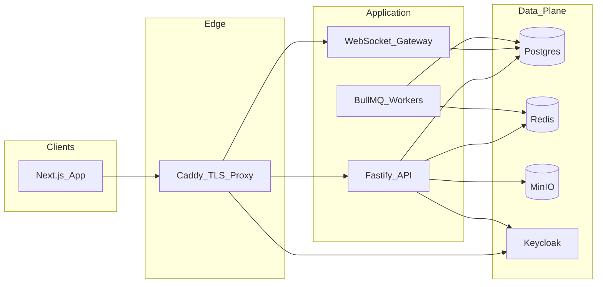

# VeraLogix SecureConnect API

Self-hosted **Firebase replacement** for SecureConnect: Fastify + Keycloak + Postgres + Redis/BullMQ + MinIO + Caddy.

No Google Firebase services are required.

## Architecture



## Quick start

### 1. Environment

```bash
cp backend/.env.example backend/.env
cp .env.example .env.local
```

### 2. Docker stack

```bash
docker compose -f docker/docker-compose.yml up --build
```

Services:

| Service | Port | Purpose |
|---------|------|---------|
| API | 3000 | REST + WebSocket + OpenAPI `/docs` |
| Keycloak | 8080 | Auth (realm `secureconnect`) |
| Postgres | 5432 | App database |
| Redis | 6379 | Cache + BullMQ |
| MinIO | 9000 / 9001 | S3 object storage + console |
| Mailpit | 8025 | Local email UI |
| Caddy | 80 | Reverse proxy |
| Prometheus/Grafana | 9090 / 3001 | `docker compose --profile observability up` |

### 3. Migrate + seed

```bash
cd backend
cp .env.example .env
npm install
npm run db:migrate
npm run db:seed
npm run dev
```

Demo Keycloak users (from realm export):

- `admin@veralogix.com` / `secureconnect` (admin, agent)
- `resident@example.com` / `resident123` (resident)

Dev bypass (local only): `DEV_AUTH_BYPASS=true` → `POST /api/v1/auth/dev-session` with header `x-dev-bypass: 1`.

## API overview

- OpenAPI UI: `http://localhost:3000/docs`
- Health: `GET /health/live`, `GET /health/ready`
- Auth: `/api/v1/auth/login|refresh|logout|me|consent|magic-link|dev-session`
- Domain CRUD: `/api/v1/{sites,units,doors,access-logs,passes,amenities,bookings,invoices,tickets,incidents,energy,ev-sessions}`
- Door unlock: `POST /api/v1/doors/:id/unlock`
- Files: `/api/v1/files/presign-upload`, `/api/v1/files/:id/presign-download`
- Admin: `/api/v1/admin/{users,storage/usage,audit,jobs,deletion-requests}`
- POPIA: `/api/v1/popia/export`, `/api/v1/popia/deletion-request`
- Realtime: `WS /ws` → `{type:'auth',token}` then `{type:'subscribe',siteId,tables}`

### Example: registration / login contract

```json
// POST /api/v1/auth/login
{ "email": "resident@example.com", "password": "resident123" }

// 200
{
  "accessToken": "<jwt>",
  "refreshToken": "<refresh>",
  "expiresIn": 300,
  "tokenType": "Bearer",
  "user": {
    "id": "uuid",
    "email": "resident@example.com",
    "name": "Demo Resident",
    "roles": ["resident"],
    "siteIds": ["uuid"]
  }
}

// 401
{ "error": { "code": "UNAUTHORIZED", "message": "...", "correlationId": "..." } }
```

## Client SDK

```ts
import { createClient } from '@veralogix/secureconnect-sdk';

const client = createClient({
  apiUrl: 'http://localhost:3000',
  wsUrl: 'ws://localhost:3000',
});

await client.login('admin@veralogix.com', 'secureconnect');
const doors = await client.list('doors', { siteId: '...' });
const unsub = client.subscribe(
  { siteId: '...', tables: ['doors', 'access_logs'] },
  (change) => console.log(change),
);
await client.uploadFile({
  siteId: '...',
  file: blob,
  filename: 'photo.jpg',
  mime: 'image/jpeg',
});
```

## Security & POPIA

- Keycloak OIDC JWTs (short-lived) + refresh rotation
- Helmet, CORS allowlist, rate limits (stricter on auth)
- Zod validation on all inputs; Drizzle parameterized SQL
- Audit log hashes payloads (data minimization)
- Consents, data export, right-to-be-forgotten worker
- Secrets via `.env` / Docker only — never commit credentials

## Testing

```bash
cd backend
npm test                 # unit
npm run test:coverage
RUN_INTEGRATION=1 API_URL=http://localhost:3000 npm run test:integration
RUN_E2E=1 API_URL=http://localhost:3000 npm run test:e2e
```

Coverage gate targets ≥85% on core modules as tests expand; unit suite covers roles, POPIA planner, errors, backoff, auth contracts.

## Horizontal scaling notes

- API is stateless — scale replicas behind Caddy/Traefik
- WebSocket: use sticky sessions or move pub/sub fanout fully through Redis
- Postgres: add PgBouncer for pool multiplexing
- Workers: scale `worker` replicas independently
- MinIO: use distributed mode for HA object storage
- Keycloak: external DB already; run clustered KC for HA

## Environment variables

See [`backend/.env.example`](../backend/.env.example) and root [`.env.example`](../.env.example).
